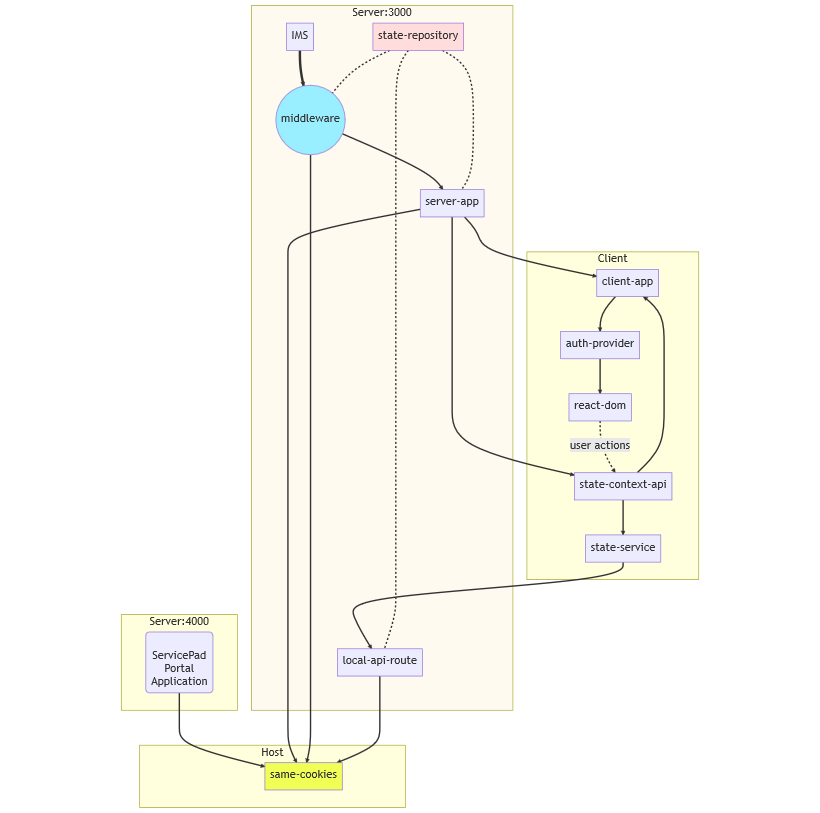

# Inventory Management System Front-End
Web-based user interface for managing inventory for different businesses.
This repository contains the front-end for the Inventory Management System (IMS).

## Unit Properties
### Fields:
UID is created once the Unit is saved, generated by the back-end
Random 8 digits (format 1234-5678)
Internal indexable ID is created
Increments from the previous Unit ID saved, or 1 if no previous Unit saved

manufacturer
M2M relationship to Org
User can choose or add (add happens in another ticket, so just choose for now)

owner
M2M relationship to Org

status
Limited to static options provided: Not Available/Available/Sold	

style
Foreign key to ModelStyle

User can choose or add (add happens in another ticket, so just choose for now)

condition
Limited to static options provided: New/Pre-Owned

### Unit Form 
- Top Section
- Main Section
    - Brand (Default to manufacturer name) === (org type)
    - Model Style
    - Size
    - Condition
    - Inventory Status
    - Dealer === (org type)
    - Distributor === (org type)
    - Manufacturer === (org type)
    - Unit Manager (called owner in the API) === (Org type)
    - Image Gallery (carousel)
- Bottom Section
    - price
        - Sales Price (retail_price)
        - Minimum Sales Price (min_retail_price)
        - Lease Price (agreement_price)
        - Minimum Lease Price (min_agreement_price)
    - characteristics
        - Color
        - Axles
        - Hitch type
        - Shipping Weight
        - GVWR
    - title
        - Status
        - Number
        - State
        - MSO
    - location
        - Customer
            If Customer, provide selection of customers
            If Org, provide selection of Orgs
            Gray out the one not being used (title, input form), on both editing and detail view
        - Company
            Physical as of date (physical_as_of)
            This is a date picker. It’s empty by default. When the user opens the date-picker they are automatically brought to the current/now date for easy selection.
    - gps
        - Serial (gps>serial)
        - Manufacturer (gps>manufacturer)

## Project Structure
- public/
    - icons/
    - images/
- script/
    - constant/
        - json/
    - state/
        - context/
        - repository/
        - service/
    - util/
        - helper/
        - hook/
        - playwright/
        - type/
- src/
    - 3d/
    - app/
        - api/
            - auth/
            - demo/
        - inventory/
        - unit/
            - [id]/
            - add/
        - layout.tsx
        - page.tsx (landing page of the app)
    - dom/
        - atoms/
            - common/
            - holders/
            - inputs/
        - cell/
        - organ/
            - carousel/
            - form/
            - table/
    - module/
        - inventory/
        - landing/
        - unit/
    - middleware.ts
- style/
    - module/
    - *.css
- package.json


Diagram (https://mermaid.live/)
```lua    
graph BT; 
  subgraph Host
  same-cookies

  style Host fill:#eaFFf0
  end

  subgraph "Server4000"[Server:4000]
  a ---> same-cookies
   a("`ServicePad
  Portal
  Application`")
  end


  subgraph "Server3000"[Server:3000]
  IMS ==> INIT
  state-repository -.- INIT
  INIT((middleware)) --> server-app
  server-app --> same-cookies
  INIT --> same-cookies
  state-repository -.- server-app

  local-api-route --> same-cookies

  style state-repository fill:#ffdddd
  style same-cookies fill:#EFFF55
  style INIT fill:#99EFFF

  style Server3000 fill:#FFfaf0
  end


  subgraph Client
  server-app --> client-app
  client-app --> auth-provider
  auth-provider --> react-dom

  state-context-api --> state-service
  state-service --> local-api-route
  state-repository -.- local-api-route

  server-app --> state-context-api
  state-context-api -->client-app
  react-dom -.->|user actions|state-context-api 

  end
```


